# Surfs-Up
Module 9 Challenge

## Overview of Project

Apply skills aquired ind Advanced Data Storage and Retrieval to access data using SQLite, Flask, Python and libraries to access specific data, query subsets of data from the tables and analyze this data to provide specific information and analysis that will assist investors with decision making.

### Purpose

Back from a recent vacation to Hawaii, the protagonist would like to move to Oahu to open a Surf and Shake shop so that they may live there full time. Although this individual has some money to invest, they quickly realize that additional investors will be needed to get this venture off the ground.  Consulting with a local Hawaiian investor W. Avy, he request for very specific data regarding the weather in Oahu.  Our analysis will provide W. Avy and other potential investors with the information that they need to make an informed decision on whether thhis investment is the right one for them.  After analyzing the weather data over several years in Oahu, W. Avy requested the analysis to be conducted on specific months. These months are June and December.  The results of the weather analysis for the months of June and December can be found below.

## Results

### Deliverable 1: June Weather Analysis Process

One of W. Avy's request was retrieve data from the dataset that would focus on the temperatures during the month of June.  This would allow the investors to see how the weather during the summer month of June would compare to the winter month of December.  After importing all of the proper libraries and supporting files, below is the query that was constructed to retrieve the temp data from the weather recording stations throught Oahu.

* Below is the 'June Temperature Query' that pulls back all temperatures recorded during the month of June from all recording stations over multiple years.  

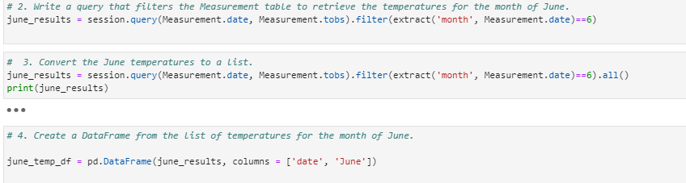

* Please review the plot below resulting from the 'June Temperature Query'

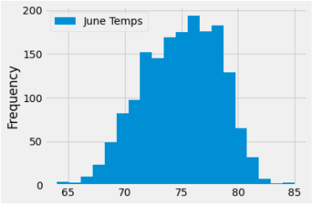

After reviewing the plot above we felt that the visual was a nice touch but, as way to help quantify the visual we decided to utilize the .describe() function found in the pandas library to provide a way for the investor(s) to quickly review the min, max, means, etc.

* Below is the same 'June Temperature Query' calculating and formatting the data in a central tendency format.  

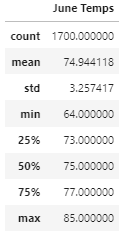

### Deliverable 2: December Weather Analysis Process

The second requested deliverable of W. Avy's request was as we did for June, retrieve data from the dataset that would focus on the temperatures during the month of December.  This would allow the investors to see how the weather during the summeer month of June would compare to the winter month of December.  Below is the query that was constructed to retrieve the temp data from the weather recording stations throught Oahu.

* Below is the 'December Temperature Query' that pulls back all temperatures recorded during the month of December from all recording stations over multiple years.  

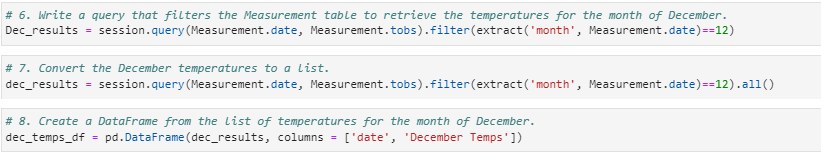

* Please review the plot below resulting from the 'December Temperature Query'

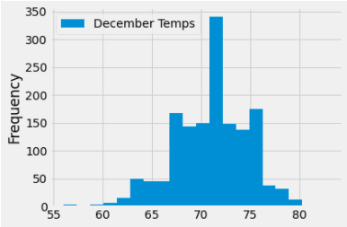

For consistancy, Just as we did with June's data, after reviewing the plot above we decided to utilize the .describe() function again to provide a way for the investor(s) to quickly review the min, max, means, etc.

* Below is the same 'December Temperature Query' calculating and formatting the data in a central tendency format.  

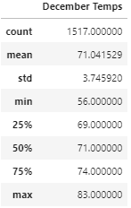

### Summaray of June and December Analysis

* For ease of reference, please see the central tendency information plotted above in a side by side format below.  

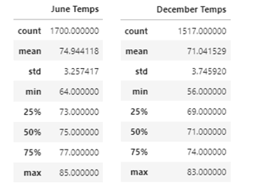

Based of the queries for June and December one will notice the following by comparing the outcomes:
  * Temperaturess are three degrees warmer for June than December
  * June max temp is two degrees warmer than December
  * The average temperature is also four degrees higher in June than in December
  * The min temperature is eight degrees cooler in December than compared to June.
  * The December bar plot above shows a greater concentration of temperatures at the 71-72 degree range, while June shows a wider range of temperature variations.

Soley based on these two queries and resulting output, there are not red flags as to whether or not a Surf and Shake shop could thrive based on temperature alone.  However, knowing that W. Avy had issues with past business ventures due to issues with weather, particularly precipitation, we believe it would be prudent to expand the analysis to account other factors.  That analysis can be found below.

## Additional Analysis

Apart from temperature, other issues that should be taken into consideration to gain a level of confidence if an investment in the Surf and Shake shop would be successful is a measurement of precipitation, particularly near the coast.  Focusing on temperature and percipitation near the coastal areas of Oahu would allow us to remove data acquired from areas that are not the target customers of the Surf and Shake shop. Catering to the surf and tourist community would mean that the shops locations would be closer to the coast and not in-land. Because of this, in-land weather data should be excluded from the data set so that the investors could get a more accuratae depiction of the weather in areas the shop tend to service. 

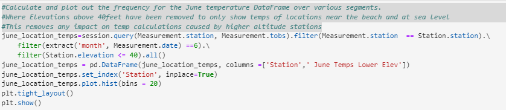
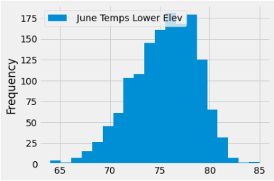
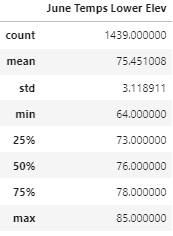
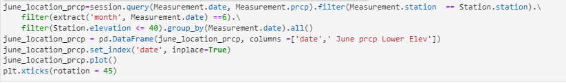
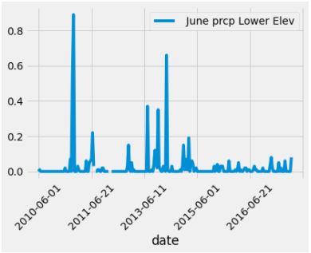
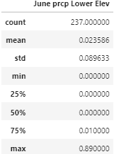
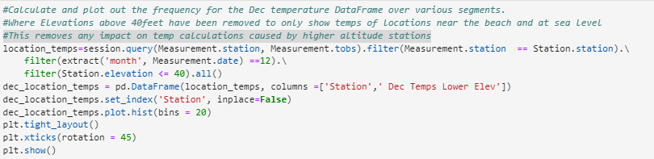
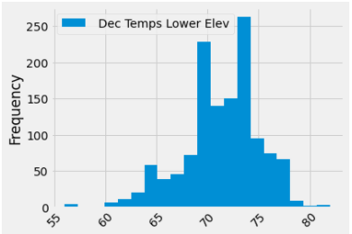
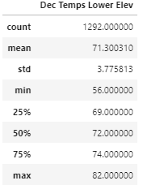
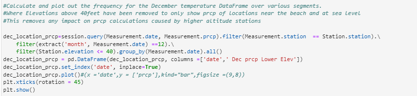
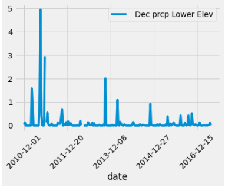
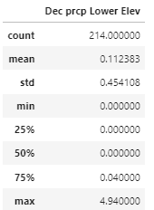
